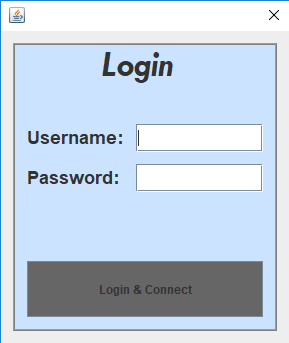
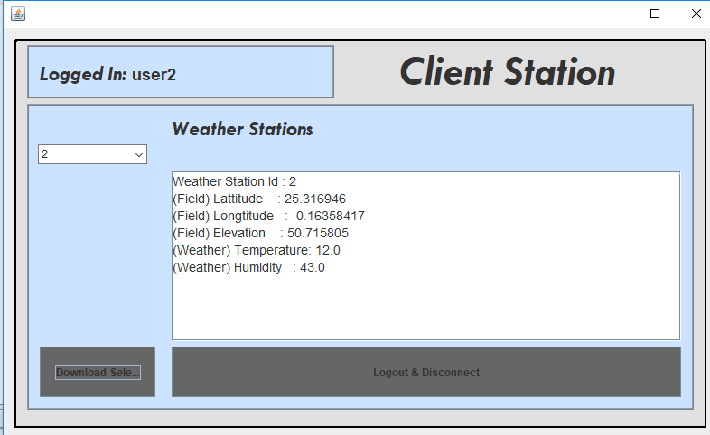
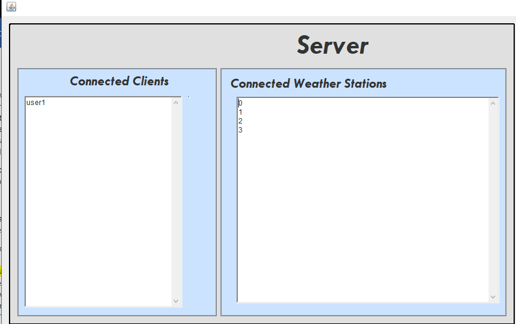

# Farmer Model
A Java-based multi-threaded concurrent client-server model. 
It retrieves field and weather data using weather stations with a user account system and a log in screen. 
With a full functioning GUI as well as a drop-down function to display weather station data. 

**Login Screen**

**Client Station**

Client station is shown after client login. 

There is a GUI to navigate through the system. 
* Select specific weather station via a drop-down menu. 
* Download data for selected weather station such as temperature and humidity as well as weather station ID. 
* Up to date information is displayed. 
* Logout and disconnect from client station

**Server**

Connected clients and weather stations are displayed on the server. 

